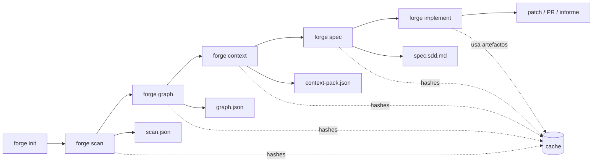
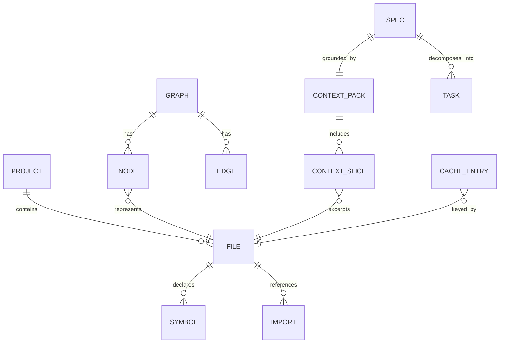

# ContextForge

## Resumen ejecutivo

La recomendación más sólida es crear un **MVP de monorepo TypeScript orientado a CLI** y no intentar replicar primero el dashboard de Understand-Anything. El valor diferencial que merece copiarse está en otra parte: una cadena **scan → graph → context → spec → implement** con artefactos reutilizables, contratos de salida estrictos y una estrategia explícita de ahorro de tokens. El repositorio que inspira este proyecto describe precisamente una combinación de análisis estático, pipeline multiagente y grafo compartible, y sus releases muestran decisiones especialmente útiles para ContextForge: pre-resolver imports, adelgazar payloads, usar validación determinista por defecto y mantener actualización incremental por huella estructural. citeturn7view0turn19view0

También conviene **reconsiderar el nombre público “ContextForge”**. En entity["company","GitHub","developer platform"] ya existe una organización `ContextForge`, y además hay repositorios públicos del ecosistema de entity["company","IBM","technology company"] con esa marca, incluido un proyecto principal llamado “ContextForge” y otro “ContextForge CLI”. Eso no impide que tú crees `OWNER/contextforge` bajo otro owner, porque la unicidad es por namespace, pero sí introduce ruido de marca, descubribilidad y confusión semántica. Mi recomendación práctica es usar como nombre del repositorio **`contextforge-cli-ts`** o **`contextforge-sdd`** y reservar “ContextForge” como nombre del producto dentro del README. citeturn29view0turn28view0turn28view1

La arquitectura recomendada es un monorepo con `packages/core`, `packages/cli`, `packages/agents` e `packages/integrations`, apoyado en `pnpm-workspace.yaml`, `packageManager` fijado y `Node.js >=22`. Esa elección encaja bien con pnpm, que tiene soporte nativo para monorepos y exige un `pnpm-workspace.yaml` en la raíz; además, Node 22 incluye Corepack para fijar y resolver el package manager del proyecto. citeturn7view16turn7view17turn7view18turn7view2

La capa de integración con agentes debe diseñarse desde el inicio para **compatibilidad cruzada**. Codex de entity["organization","OpenAI","ai lab"] lee `AGENTS.md` antes de trabajar y descubre skills en `.agents/skills`; OpenCode también usa `AGENTS.md` y además descubre skills en `.opencode/skills`, `.claude/skills` y `.agents/skills`; Claude Code de entity["company","Anthropic","ai company"] lee `CLAUDE.md`, no `AGENTS.md`, pero su propia documentación recomienda crear un `CLAUDE.md` que importe `@AGENTS.md` para evitar duplicación. Esa compatibilidad permite que ContextForge mantenga **una sola fuente de instrucciones** y unos skills compartidos con symlinks o duplicación mínima. citeturn7view10turn9view0turn11view3turn24view1

La decisión final, por tanto, es: **repo CLI-first, monorepo pnpm, output schemas validados localmente, caché por hash, prompts cortos y especializados, skills compartidos, CI oficial y release por tags**. El primer entregable útil no es “ver el grafo”, sino producir de forma reproducible `scan.json`, `graph.json`, `context-pack.json` y una `spec.sdd.md` que luego pueda ejecutar un agente con el menor contexto posible. Esa estrategia está alineada con la forma en que Codex, OpenCode y Claude gestionan instrucciones, skills y carga perezosa de contexto. citeturn10view2turn9view6turn11view3turn12view2

### Decisión recomendada

| Dimensión | Recomendación |
|---|---|
| Nombre de repo | `contextforge-cli-ts` |
| Nombre de producto | `ContextForge` |
| Forma inicial | Monorepo pnpm |
| Runtime | Node.js 22+ |
| Lenguaje | TypeScript |
| Parsing | Determinista primero, `tree-sitter` opcional |
| Artefactos centrales | `scan.json`, `graph.json`, `context-pack.json`, `spec.sdd.md` |
| Mandato principal | Ahorrar tokens con hashing, slicing y prompts cortos |
| Licencia | MIT |
| Publicación | GitHub + Actions + release por tags |

### Asunciones y no especificado

| Elemento | Estado |
|---|---|
| Owner del repositorio | **No especificado** |
| Visibilidad del repo | **No especificado** |
| Credenciales GitHub / PAT | **No provistas** |
| Permisos de creación de secretos y releases | **No especificados** |
| Publicación en npm | **No especificado** |
| Modelo exacto por defecto en Codex | **No especificado en las fuentes consultadas** |
| Modelo exacto por defecto en Claude Code | **No especificado en las fuentes consultadas** |
| Licencia | **MIT asumida**, según tu requisito |

## Hallazgos clave

Understand-Anything justifica bien la inspiración técnica, pero también marca un límite claro: su README vende “grafo interactivo”, mientras que su arquitectura útil para ContextForge es el pipeline multiagente, la exportación de un grafo JSON y la posibilidad de compartir artefactos del análisis. Además, su historial de releases documenta una reducción de coste cercana al 85% basada en import maps pre-resueltos, payloads más finos y revisión LLM solo bajo bandera explícita; exactamente esas lecciones son las que más conviene incorporar al MVP que estás planteando. citeturn7view0turn20view3turn19view0

La segunda conclusión fuerte es que **no hace falta hacer de `tree-sitter` una dependencia estructural del MVP**. Tree-sitter es valioso como generador de parsers e infraestructura de parsing incremental, con binding oficial para Node.js y soporte para muchos lenguajes, pero el propio Understand-Anything demostró que se pueden cubrir bastantes tipos de archivo con parsers estructurales específicos sin depender de tree-sitter para todo. En ContextForge eso sugiere una estrategia de dos fases: MVP 1 con parsing determinista básico por extensión y heurísticas; MVP 2/MVP 3 con adaptadores opcionales a tree-sitter para símbolos más ricos en TypeScript, Python, Go y similares. citeturn8view0turn19view0

La tercera conclusión es que el **coste de contexto no debe vivirse solo en inferencia, sino en la propia arquitectura de instrucciones**. Codex usa “progressive disclosure” para skills: primero carga nombre, descripción y ruta, y solo lee el `SKILL.md` cuando decide usarlo; Claude Code afirma que el cuerpo del skill carga solo cuando se invoca o se vuelve relevante; OpenCode también carga skills bajo demanda a través de la herramienta `skill`. Esto respalda una decisión de diseño central: **mover procedimientos largos fuera de `AGENTS.md` y `CLAUDE.md` hacia skills específicos**, dejando en los archivos de memoria solo normas globales y comandos básicos. citeturn10view2turn9view6turn11view3turn24view1

La cuarta conclusión afecta al nombre y al posicionamiento del repositorio. “ContextForge” ya tiene presencia organizativa y repositorios públicos en otro ecosistema; por tanto, si quieres claridad de marca técnica, conviene desacoplar el nombre comercial del nombre del repo. Mi recomendación concreta es esta tabla:

| Opción | Recomendación |
|---|---|
| `contextforge-cli-ts` | **La mejor** para el MVP |
| `contextforge-sdd` | Muy buena si quieres enfatizar specs |
| `contextforge-codegraph` | Buena si quieres enfatizar el grafo |
| `contextforge` | Válida solo si aceptas colisión de naming |

### Cuestiones abiertas y límites

Quedan tres puntos que no se pueden cerrar con rigor porque no están especificados: el owner real del repo, la visibilidad deseada y el método concreto de autenticación/permiso con el que Codex u OpenCode operarían sobre GitHub. Todo lo demás puede prepararse ya. citeturn26view3turn26view4turn10view4turn30view2

## Arquitectura propuesta

La propuesta funcional para el MVP es la siguiente: `forge init` crea la estructura, `forge scan` genera un inventario estructural y hashes, `forge graph` materializa relaciones, `forge context` empaqueta solo el contexto mínimo necesario para una tarea, `forge spec` redacta una spec SDD a partir del grafo y del context pack, y `forge implement` delega esa spec a un agente externo o genera un plan local. Esta cadena encaja con el patrón que ya demostró Understand-Anything, pero reduce el objetivo a artefactos consumibles por máquinas y por agentes, antes de pensar en visualización. citeturn7view0turn19view0

### Flujo propuesto



### Diagrama entidad-relación



### Comandos recomendados

| Comando | Entrada principal | Salida principal | Usa LLM por defecto | Caché |
|---|---|---|---|---|
| `forge init` | directorio | estructura base | no | no |
| `forge scan` | árbol de ficheros | `scan.json` | no | sí |
| `forge graph` | `scan.json` | `graph.json` | no | sí |
| `forge context` | `graph.json` + objetivo | `context-pack.json` | opcional | sí |
| `forge spec` | context pack + plantilla | `spec.sdd.md` | sí/mixto | sí |
| `forge implement` | spec + adapter | plan, patch o PR | sí | sí |

### Estructura de monorepo recomendada

pnpm tiene soporte nativo para workspaces y monorepos, y OpenCode/Claude soportan descubrimiento de skills y reglas en subdirectorios, lo que favorece especialmente una estructura por paquetes. citeturn7view16turn21view0turn12view2

```text
contextforge-cli-ts/
├─ .github/
│  ├─ workflows/
│  │  ├─ ci.yml
│  │  └─ release.yml
│  ├─ ISSUE_TEMPLATE/
│  │  ├─ bug_report.yml
│  │  └─ config.yml
│  └─ PULL_REQUEST_TEMPLATE.md
├─ .contextforge/
│  ├─ templates/
│  │  ├─ spec.sdd.md
│  │  ├─ context-pack.template.json
│  │  └─ graph.template.json
│  └─ structure/
│     └─ example.tree.json
├─ .agents/
│  └─ skills/
│     ├─ graph-builder/
│     │  └─ SKILL.md
│     ├─ context-selector/
│     │  └─ SKILL.md
│     └─ spec-writer/
│        └─ SKILL.md
├─ .opencode/
│  └─ commands/
│     └─ forge-spec.md
├─ packages/
│  ├─ core/
│  │  ├─ package.json
│  │  ├─ tsconfig.json
│  │  └─ src/
│  │     └─ scanner.ts
│  ├─ cli/
│  │  ├─ package.json
│  │  ├─ tsconfig.json
│  │  └─ src/
│  │     └─ index.ts
│  ├─ agents/
│  │  └─ package.json
│  └─ integrations/
│     └─ package.json
├─ AGENTS.md
├─ CLAUDE.md
├─ CONTRIBUTING.md
├─ LICENSE
├─ README.md
├─ eslint.config.js
├─ package.json
├─ pnpm-workspace.yaml
├─ tsconfig.json
├─ .forgeignore
└─ .gitignore
```

## Integraciones y estrategia de tokens

La integración correcta con agentes no es “enviar todo el repo al modelo”, sino **darle instrucciones persistentes cortas y cargar procedimientos solo cuando hagan falta**. Codex lee `AGENTS.md` automáticamente antes de trabajar; OpenCode también usa `AGENTS.md`; Claude Code no lo hace, pero su propia documentación recomienda crear un `CLAUDE.md` que importe `@AGENTS.md`. Para un proyecto que quiere ahorrar tokens, esta es probablemente la decisión más importante de diseño después del hashing. citeturn7view10turn7view6turn24view1

La segunda capa son los skills. Codex busca skills en `.agents/skills` a lo largo del camino desde el directorio actual hasta la raíz del repo y solo carga el contenido completo del `SKILL.md` al usarlo; OpenCode descubre `.opencode/skills`, `.claude/skills` y `.agents/skills`; Claude Code usa `.claude/skills/<skill>/SKILL.md` y también resuelve skills en subdirectorios del monorepo. Esto justifica una convención de compatibilidad: **guardar la versión canónica en `.agents/skills` y exponerla por symlink o duplicado mínimo en `.claude/skills` y `.opencode/skills` cuando haga falta compatibilidad total**. citeturn10view0turn10view2turn11view3turn12view2

En cuanto a modelos, la foto más rigurosa es esta. Codex CLI puede instalarse con npm, ejecutarse localmente y autenticarse con cuenta ChatGPT o API key, pero las fuentes consultadas no fijan un modelo por defecto universal; sí exponen `--model`, `--output-schema` y controles de sandbox. OpenCode es explícitamente configurable por provider/model y la documentación ilustra modelos principales y baratos por separado; además soporta 75+ proveedores y modelos locales. En Claude Code, el hecho estable es que trabaja sobre modelos Claude; la selección concreta del modelo en tu entorno no queda fijada por las fuentes consultadas para este informe. citeturn10view4turn10view6turn9view9turn9view8turn23search14

### Comparativa operativa de integración

| Herramienta | Archivo de instrucciones | Skills por proyecto | Instalación mínima | Nota práctica para ContextForge |
|---|---|---|---|---|
| Codex | `AGENTS.md` | `.agents/skills` | `npm i -g @openai/codex` | La mejor para `--output-schema` y runs no interactivos |
| OpenCode | `AGENTS.md` | `.opencode/skills`, `.claude/skills`, `.agents/skills` | `pnpm install -g opencode-ai` o script | Muy flexible en proveedor/modelo y permisos |
| Claude Code | `CLAUDE.md` importando `@AGENTS.md` | `.claude/skills` | script oficial `claude` | Excelente para skills y contexto por reglas |

### Reglas concretas para ahorrar tokens

| Regla | Implementación recomendada |
|---|---|
| No meter procedimientos largos en memoria global | `AGENTS.md` y `CLAUDE.md` < 200 líneas |
| Cargar workflows solo bajo demanda | Skills específicos por tarea |
| Reutilizar análisis estático | `scan.json` y `graph.json` con hash |
| Evitar relectura del repo entero | context packs por objetivo |
| Revisión LLM opcional | `--review` o `--enrich` explícito |
| Separar modelo caro y barato | selector/config por fase |
| Validar salida siempre | JSON Schema local; `--output-schema` en Codex cuando aplique |

Claude Code recomienda mantener `CLAUDE.md` específico y conciso, idealmente por debajo de 200 líneas; además distingue entre memoria persistente, rules y skills para no saturar contexto. OpenCode sugiere temperaturas bajas para análisis y planificación. Codex permite validar la forma de salida con `--output-schema`. Esa combinación sugiere una política clara para ContextForge: **análisis determinista primero; LLM solo en `context`, `spec` e `implement`; y siempre con salida estructurada validable**. citeturn24view1turn21view0turn10view6

### Contratos de salida recomendados para los agentes

Codex soporta ejecutar tareas no interactivas con `codex exec` y validar la respuesta final contra un JSON Schema; OpenCode y Claude no exponen exactamente el mismo flag en las fuentes revisadas, pero puedes aplicar la misma validación en tu CLI tras recibir la salida. Por eso propongo que ContextForge trate los schemas como parte del producto, no como un detalle de una integración concreta. citeturn10view6turn21view0turn12view3

#### Prompt para `graph-builder`

```md
Eres graph-builder de ContextForge.

Objetivo:
- Convertir un scan estructural en un grafo JSON determinista.
- Prioriza precisión estructural sobre cobertura semántica.

Reglas:
- No inventes nodos que no estén sustentados por el scan.
- Mantén ids estables.
- Distingue claramente file, folder, symbol y dependency.
- Devuelve solo JSON válido conforme al schema.
- Si faltan datos, usa arrays vacíos; no añadas texto explicativo.

Entrada:
- scan_result
- project_metadata
- graph_policy

Salida:
- graph.json
```

#### Schema para `graph-builder`

```json
{
  "$schema": "https://json-schema.org/draft/2020-12/schema",
  "title": "GraphBuildResult",
  "type": "object",
  "required": ["schemaVersion", "project", "nodes", "edges"],
  "properties": {
    "schemaVersion": { "type": "string" },
    "project": {
      "type": "object",
      "required": ["name", "root"],
      "properties": {
        "name": { "type": "string" },
        "root": { "type": "string" }
      },
      "additionalProperties": false
    },
    "nodes": {
      "type": "array",
      "items": {
        "type": "object",
        "required": ["id", "type", "label"],
        "properties": {
          "id": { "type": "string" },
          "type": { "enum": ["folder", "file", "symbol", "dependency"] },
          "label": { "type": "string" },
          "path": { "type": "string" },
          "hash": { "type": "string" }
        },
        "additionalProperties": true
      }
    },
    "edges": {
      "type": "array",
      "items": {
        "type": "object",
        "required": ["from", "to", "type"],
        "properties": {
          "from": { "type": "string" },
          "to": { "type": "string" },
          "type": { "enum": ["contains", "imports", "calls", "depends_on", "defines"] }
        },
        "additionalProperties": false
      }
    }
  },
  "additionalProperties": false
}
```

#### Prompt para `context-selector`

```md
Eres context-selector de ContextForge.

Objetivo:
- Seleccionar solo el contexto mínimo suficiente para resolver una tarea.
- Minimiza tokens sin perder dependencias esenciales.

Reglas:
- Usa el grafo como índice principal.
- Añade primero archivos seed, luego closure de imports, luego símbolos relevantes.
- Limita el pack por presupuesto.
- Resume cuando el presupuesto no permita incluir contenido completo.
- Devuelve solo JSON válido conforme al schema.

Entrada:
- graph
- task
- budget
- selection_policy

Salida:
- context-pack.json
```

#### Schema para `context-selector`

```json
{
  "$schema": "https://json-schema.org/draft/2020-12/schema",
  "title": "ContextPack",
  "type": "object",
  "required": ["schemaVersion", "task", "budget", "files"],
  "properties": {
    "schemaVersion": { "type": "string" },
    "task": { "type": "string" },
    "budget": {
      "type": "object",
      "required": ["maxInputTokens"],
      "properties": {
        "maxInputTokens": { "type": "integer", "minimum": 1 },
        "estimatedTokens": { "type": "integer", "minimum": 0 }
      },
      "additionalProperties": false
    },
    "files": {
      "type": "array",
      "items": {
        "type": "object",
        "required": ["path", "reason", "mode"],
        "properties": {
          "path": { "type": "string" },
          "reason": { "type": "string" },
          "mode": { "enum": ["full", "excerpt", "summary"] },
          "hash": { "type": "string" },
          "excerpt": { "type": "string" }
        },
        "additionalProperties": false
      }
    }
  },
  "additionalProperties": false
}
```

#### Prompt para `spec-writer`

```md
Eres spec-writer de ContextForge.

Objetivo:
- Redactar una spec SDD accionable y verificable.
- La spec debe ser suficiente para implementación sin volver a cargar el repo completo.

Reglas:
- Usa únicamente datos del context pack y el grafo.
- Define alcance, exclusiones, criterios de aceptación, riesgos, pruebas y tareas.
- Propón cambios mínimos.
- No escribas implementación completa.
- Devuelve Markdown limpio y, si se pide, un resumen JSON paralelo.

Entrada:
- task
- graph_summary
- context_pack
- spec_template

Salida:
- spec.sdd.md
```

#### Schema para `spec-writer`

```json
{
  "$schema": "https://json-schema.org/draft/2020-12/schema",
  "title": "SpecWriterSummary",
  "type": "object",
  "required": ["title", "scope", "acceptanceCriteria", "tasks"],
  "properties": {
    "title": { "type": "string" },
    "scope": { "type": "array", "items": { "type": "string" } },
    "acceptanceCriteria": { "type": "array", "items": { "type": "string" } },
    "tasks": {
      "type": "array",
      "items": {
        "type": "object",
        "required": ["id", "description"],
        "properties": {
          "id": { "type": "string" },
          "description": { "type": "string" },
          "files": { "type": "array", "items": { "type": "string" } }
        },
        "additionalProperties": false
      }
    }
  },
  "additionalProperties": false
}
```

### Tabla comparativa de acciones manuales vs automatizables por Codex

Codex CLI puede leer, editar y ejecutar código/comandos localmente; además, en modo no interactivo soporta schemas de salida y sandbox configurable. Por tanto, muchas tareas del repo son automatizables, pero la parte que toca GitHub depende de que `gh` y los permisos estén realmente configurados. Si no lo están, debe marcarse como **no especificado**. citeturn10view4turn10view6turn26view3turn26view4

| Acción | Manual | Automatizable por Codex | Condición |
|---|---|---|---|
| Crear estructura local del repo | sí | sí | acceso de escritura local |
| Generar archivos base | sí | sí | acceso de escritura local |
| Ejecutar `pnpm install`, `lint`, `test`, `build` | sí | sí | Node/pnpm instalados |
| Crear repo remoto con `gh repo create` | sí | sí | `gh` autenticado y permisos válidos |
| Crear secrets con `gh secret set` | sí | sí | permisos de write/admin adecuados |
| Crear tag y release | sí | sí | repo remoto existente y permisos |
| Publicar skill/plugin en marketplaces | sí | **no especificado** | depende del ecosistema y permisos |
| Seleccionar modelo concreto por defecto | sí | **parcial** | depende de configuración y plan |

## GitHub, CI y seguridad

Para el CI inicial, la combinación más limpia es **acciones oficiales + Corepack + pnpm cache**. `actions/setup-node` soporta cache para pnpm; GitHub recomienda limitar permisos del `GITHUB_TOKEN`; y Corepack en Node permite fijar la versión del package manager del proyecto. En un repo nuevo yo evitaría empezar con una acción de terceros para instalar pnpm, porque GitHub advierte expresamente del riesgo de acciones de terceros y recomienda pin a SHA completo para endurecimiento. citeturn7view21turn16view0turn16view1turn16view3turn22view2turn7view18

La release pipeline recomendada es sencilla: **push de tags semver → workflow `release.yml` → `gh release create` con notas generadas**. GitHub CLI está preinstalado en runners hosteados por GitHub y solo necesita `GH_TOKEN`; la creación de releases también está documentada con `gh release create`. La ventaja de este enfoque es que no introduces una acción adicional para algo que el runner ya trae. citeturn31view0turn7view23turn7view30

La política de secretos también debe fijarse desde el primer commit. GitHub Actions solo puede leer un secreto si se incluye explícitamente en el workflow; GitHub recomienda principio de mínimo privilegio y permisos mínimos del `GITHUB_TOKEN`; y pnpm permite usar tokens vía variables de entorno en `.npmrc`, añadiendo además que determinados secretos sensibles no deben escribirse en un `.npmrc` de proyecto comprometido al repositorio. La consecuencia práctica es clara: **nada de PATs, `_authToken`, claves o `.env` reales en git**; todo lo sensible via `gh secret set`, variables de entorno o `.env.local` ignorado. citeturn16view2turn16view3turn16view4turn16view6

### Workflows y plantillas recomendados

| Archivo | Decisión |
|---|---|
| `.github/workflows/ci.yml` | checkout + setup-node + corepack + pnpm install + lint + test + build |
| `.github/workflows/release.yml` | trigger por tag `v*.*.*`, `GH_TOKEN`, `gh release create` |
| `.github/ISSUE_TEMPLATE/config.yml` | desactivar blank issues si quieres mayor disciplina |
| `.github/ISSUE_TEMPLATE/bug_report.yml` | bug report mínimo |
| `.github/PULL_REQUEST_TEMPLATE.md` | checklist de spec, tests, docs, breaking changes |
| `CONTRIBUTING.md` | setup, reglas de commit, flujo de PR |
| `.gitignore` | Node + artefactos + ficheros locales |
| `.forgeignore` | exclusión del scanner/context builder |

### Checklist de PR recomendada

```md
- [ ] La spec SDD existe o se ha actualizado
- [ ] El cambio está acotado al alcance descrito
- [ ] `pnpm lint` pasa
- [ ] `pnpm test` pasa
- [ ] `pnpm build` pasa
- [ ] Se han añadido o actualizado ejemplos/README si aplica
- [ ] No se han incluido secretos, tokens ni ficheros locales
- [ ] Se ha indicado si hay breaking changes
- [ ] Se ha validado el impacto en `graph.json` y `context-pack`
```

## Archivos iniciales listos para copiar y pegar

### Tabla de archivos a crear

| Archivo | Obligatorio | Motivo |
|---|---|---|
| `package.json` | sí | workspaces, scripts y toolchain |
| `pnpm-workspace.yaml` | sí | raíz del workspace pnpm |
| `tsconfig.json` | sí | build de TypeScript |
| `README.md` | sí | onboarding y uso |
| `LICENSE` | sí | MIT |
| `.github/workflows/ci.yml` | sí | CI base |
| `.github/workflows/release.yml` | sí | releases por tag |
| `.gitignore` | sí | higiene básica |
| `.forgeignore` | sí | higiene del scanner |
| `packages/core/src/scanner.ts` | sí | escaneo determinista |
| `packages/cli/src/index.ts` | sí | comandos `forge` |
| `.contextforge/templates/spec.sdd.md` | sí | plantilla SDD |
| `.contextforge/templates/context-pack.template.json` | sí | plantilla de pack |
| `.contextforge/templates/graph.template.json` | sí | plantilla de grafo |
| `.contextforge/structure/example.tree.json` | sí | ejemplo de estructura |
| `AGENTS.md` | muy recomendable | instrucciones comunes para Codex/OpenCode |
| `CLAUDE.md` | muy recomendable | puente para Claude Code |
| `CONTRIBUTING.md` | recomendable | gobernanza mínima |
| `.github/ISSUE_TEMPLATE/*` | recomendable | calidad de issues |
| `.github/PULL_REQUEST_TEMPLATE.md` | recomendable | calidad de PRs |

### `package.json`

```json
{
  "name": "contextforge-cli-ts",
  "private": true,
  "version": "0.1.0",
  "description": "ContextForge MVP CLI for structural graphs, context packs and SDD specs",
  "license": "MIT",
  "type": "module",
  "packageManager": "pnpm@10.0.0",
  "engines": {
    "node": ">=22.0.0"
  },
  "workspaces": [
    "packages/*"
  ],
  "scripts": {
    "build": "pnpm -r build",
    "test": "vitest run",
    "lint": "eslint . && prettier --check .",
    "format": "prettier --write .",
    "start": "tsx packages/cli/src/index.ts",
    "forge": "tsx packages/cli/src/index.ts"
  },
  "devDependencies": {
    "@typescript-eslint/eslint-plugin": "^8.0.0",
    "@typescript-eslint/parser": "^8.0.0",
    "eslint": "^9.0.0",
    "prettier": "^3.0.0",
    "tsx": "^4.0.0",
    "typescript": "^5.0.0",
    "vitest": "^3.0.0"
  }
}
```

### `pnpm-workspace.yaml`

```yaml
packages:
  - "packages/*"
```

### `tsconfig.json`

```json
{
  "files": [],
  "references": [
    { "path": "./packages/core" },
    { "path": "./packages/cli" }
  ],
  "compilerOptions": {
    "target": "ES2022",
    "module": "NodeNext",
    "moduleResolution": "NodeNext",
    "lib": ["ES2022"],
    "strict": true,
    "declaration": true,
    "declarationMap": true,
    "sourceMap": true,
    "resolveJsonModule": true,
    "esModuleInterop": true,
    "skipLibCheck": true,
    "noEmitOnError": true
  }
}
```

### `packages/core/package.json`

```json
{
  "name": "@contextforge/core",
  "version": "0.1.0",
  "type": "module",
  "main": "dist/scanner.js",
  "types": "dist/scanner.d.ts",
  "exports": {
    ".": {
      "types": "./dist/scanner.d.ts",
      "default": "./dist/scanner.js"
    }
  },
  "scripts": {
    "build": "tsc -p tsconfig.json"
  }
}
```

### `packages/core/tsconfig.json`

```json
{
  "extends": "../../tsconfig.json",
  "compilerOptions": {
    "rootDir": "src",
    "outDir": "dist",
    "composite": true
  },
  "include": ["src/**/*.ts"]
}
```

### `packages/cli/package.json`

```json
{
  "name": "@contextforge/cli",
  "version": "0.1.0",
  "type": "module",
  "bin": {
    "forge": "dist/index.js"
  },
  "main": "dist/index.js",
  "types": "dist/index.d.ts",
  "dependencies": {
    "@contextforge/core": "workspace:*"
  },
  "scripts": {
    "build": "tsc -p tsconfig.json"
  }
}
```

### `packages/cli/tsconfig.json`

```json
{
  "extends": "../../tsconfig.json",
  "compilerOptions": {
    "rootDir": "src",
    "outDir": "dist",
    "composite": true
  },
  "include": ["src/**/*.ts"],
  "references": [{ "path": "../core" }]
}
```

### `packages/agents/package.json`

```json
{
  "name": "@contextforge/agents",
  "version": "0.1.0",
  "private": true,
  "type": "module"
}
```

### `packages/integrations/package.json`

```json
{
  "name": "@contextforge/integrations",
  "version": "0.1.0",
  "private": true,
  "type": "module"
}
```

### `.gitignore`

```gitignore
node_modules/
dist/
coverage/
.vscode/
.idea/
.DS_Store

.env
.env.*
!.env.example

.contextforge/cache/
.contextforge/output/
.contextforge/tmp/

CLAUDE.local.md
.claude/settings.local.json

pnpm-lock.yaml
```

### `.forgeignore`

El diseño de `.forgeignore` se inspira en el patrón de `.understandignore`: exclusión explícita del análisis, separada de `.gitignore`, para controlar mejor qué entra en el pipeline. citeturn19view0

```gitignore
.git/
node_modules/
dist/
coverage/
.contextforge/cache/
.contextforge/output/
.contextforge/tmp/

*.png
*.jpg
*.jpeg
*.gif
*.svg
*.pdf
*.zip
*.tar
*.gz
*.lock
```

### `eslint.config.js`

```js
import tseslint from "@typescript-eslint/eslint-plugin";
import tsParser from "@typescript-eslint/parser";

export default [
  {
    files: ["**/*.ts"],
    ignores: ["**/dist/**", "**/node_modules/**"],
    languageOptions: {
      parser: tsParser,
      parserOptions: {
        project: false,
        sourceType: "module"
      }
    },
    plugins: {
      "@typescript-eslint": tseslint
    },
    rules: {
      "no-console": "off",
      "@typescript-eslint/no-explicit-any": "warn"
    }
  }
];
```

### `.prettierrc.json`

```json
{
  "semi": true,
  "singleQuote": false,
  "trailingComma": "none"
}
```

### `.github/workflows/ci.yml`

Este workflow usa `actions/setup-node` con cache para pnpm y Corepack. Para endurecimiento posterior, sustituye los tags por SHAs completos verificados. citeturn7view21turn22view2

```yaml
name: ci

on:
  push:
    branches: [main]
  pull_request:

permissions:
  contents: read

jobs:
  test:
    runs-on: ubuntu-latest

    steps:
      - name: Checkout
        uses: actions/checkout@v4

      - name: Setup Node.js
        uses: actions/setup-node@v4
        with:
          node-version: "22"
          cache: "pnpm"

      - name: Enable Corepack
        run: corepack enable

      - name: Install dependencies
        run: pnpm install --no-frozen-lockfile

      - name: Lint
        run: pnpm lint

      - name: Test
        run: pnpm test

      - name: Build
        run: pnpm build
```

### `.github/workflows/release.yml`

GitHub CLI está preinstalado en runners hosteados por GitHub; basta con pasar `GH_TOKEN`. citeturn31view0turn16view0

```yaml
name: release

on:
  push:
    tags:
      - "v*.*.*"

permissions:
  contents: write

jobs:
  release:
    runs-on: ubuntu-latest

    steps:
      - name: Checkout
        uses: actions/checkout@v4

      - name: Create GitHub release
        run: gh release create "${GITHUB_REF_NAME}" --generate-notes
        env:
          GH_TOKEN: ${{ secrets.GITHUB_TOKEN }}
```

### `packages/core/src/scanner.ts`

```ts
import { createHash } from "node:crypto";
import { promises as fs } from "node:fs";
import path from "node:path";

export interface ScanFile {
  path: string;
  ext: string;
  size: number;
  hash: string;
  kind: "code" | "config" | "doc" | "asset" | "unknown";
}

export interface ScanResult {
  schemaVersion: string;
  root: string;
  generatedAt: string;
  files: ScanFile[];
}

const DEFAULT_IGNORES = [
  ".git",
  "node_modules",
  "dist",
  "coverage",
  ".contextforge/cache",
  ".contextforge/output",
  ".contextforge/tmp"
];

function normalizePath(value: string): string {
  return value.split(path.sep).join("/");
}

function sha256(input: string): string {
  return createHash("sha256").update(input).digest("hex");
}

function classifyFile(filePath: string): ScanFile["kind"] {
  const ext = path.extname(filePath).toLowerCase();

  if ([".ts", ".tsx", ".js", ".jsx", ".py", ".go", ".rs", ".java"].includes(ext)) {
    return "code";
  }

  if ([".json", ".yaml", ".yml", ".toml", ".env", ".ini"].includes(ext)) {
    return "config";
  }

  if ([".md", ".mdx", ".txt", ".rst"].includes(ext)) {
    return "doc";
  }

  if ([".png", ".jpg", ".jpeg", ".gif", ".svg", ".pdf"].includes(ext)) {
    return "asset";
  }

  return "unknown";
}

async function readForgeIgnore(root: string): Promise<string[]> {
  const candidate = path.join(root, ".forgeignore");

  try {
    const content = await fs.readFile(candidate, "utf8");
    const lines = content
      .split(/\r?\n/)
      .map((line) => line.trim())
      .filter((line) => line && !line.startsWith("#"));
    return [...DEFAULT_IGNORES, ...lines];
  } catch {
    return DEFAULT_IGNORES;
  }
}

function isIgnored(relativePath: string, ignoreRules: string[]): boolean {
  return ignoreRules.some((rule) => {
    const normalizedRule = normalizePath(rule).replace(/\/+$/, "");
    return (
      relativePath === normalizedRule ||
      relativePath.startsWith(`${normalizedRule}/`)
    );
  });
}

async function walkDir(
  root: string,
  currentDir: string,
  ignoreRules: string[],
  acc: ScanFile[]
): Promise<void> {
  const entries = await fs.readdir(currentDir, { withFileTypes: true });

  for (const entry of entries) {
    const absolutePath = path.join(currentDir, entry.name);
    const relativePath = normalizePath(path.relative(root, absolutePath));

    if (isIgnored(relativePath, ignoreRules)) {
      continue;
    }

    if (entry.isDirectory()) {
      await walkDir(root, absolutePath, ignoreRules, acc);
      continue;
    }

    if (!entry.isFile()) {
      continue;
    }

    const content = await fs.readFile(absolutePath);
    const ext = path.extname(entry.name).toLowerCase();

    acc.push({
      path: relativePath,
      ext,
      size: content.byteLength,
      hash: sha256(content.toString("utf8")),
      kind: classifyFile(relativePath)
    });
  }
}

export async function scanProject(rootDir: string): Promise<ScanResult> {
  const root = path.resolve(rootDir);
  const ignoreRules = await readForgeIgnore(root);
  const files: ScanFile[] = [];

  await walkDir(root, root, ignoreRules, files);

  files.sort((a, b) => a.path.localeCompare(b.path));

  return {
    schemaVersion: "0.1.0",
    root: normalizePath(root),
    generatedAt: new Date().toISOString(),
    files
  };
}
```

### `packages/cli/src/index.ts`

```ts
#!/usr/bin/env node
import { promises as fs } from "node:fs";
import path from "node:path";
import { scanProject } from "@contextforge/core";

type JsonValue = Record<string, unknown> | unknown[];

async function ensureDir(dir: string): Promise<void> {
  await fs.mkdir(dir, { recursive: true });
}

async function writeJson(filePath: string, value: JsonValue): Promise<void> {
  await ensureDir(path.dirname(filePath));
  await fs.writeFile(filePath, JSON.stringify(value, null, 2) + "\n", "utf8");
}

async function writeText(filePath: string, value: string): Promise<void> {
  await ensureDir(path.dirname(filePath));
  await fs.writeFile(filePath, value, "utf8");
}

function outPath(...parts: string[]): string {
  return path.join(process.cwd(), ".contextforge", ...parts);
}

async function cmdInit(): Promise<void> {
  await ensureDir(outPath("templates"));
  await ensureDir(outPath("structure"));
  await ensureDir("packages/core/src");
  await ensureDir("packages/cli/src");
  console.log("ContextForge inicializado.");
}

async function cmdScan(): Promise<void> {
  const result = await scanProject(process.cwd());
  await writeJson(outPath("scan.json"), result);
  console.log("Escrito .contextforge/scan.json");
}

async function cmdGraph(): Promise<void> {
  const scan = JSON.parse(await fs.readFile(outPath("scan.json"), "utf8")) as {
    files: Array<{ path: string; hash: string; kind: string }>;
  };

  const graph = {
    schemaVersion: "0.1.0",
    nodes: scan.files.map((file) => ({
      id: `file:${file.path}`,
      type: "file",
      label: file.path.split("/").pop(),
      path: file.path,
      hash: file.hash,
      kind: file.kind
    })),
    edges: [] as Array<{ from: string; to: string; type: string }>
  };

  await writeJson(outPath("graph.json"), graph);
  console.log("Escrito .contextforge/graph.json");
}

async function cmdContext(): Promise<void> {
  const graph = JSON.parse(await fs.readFile(outPath("graph.json"), "utf8")) as {
    nodes: Array<{ path: string; id: string }>;
  };

  const pack = {
    schemaVersion: "0.1.0",
    task: "Describe la tarea aquí",
    budget: {
      maxInputTokens: 12000,
      estimatedTokens: 0
    },
    files: graph.nodes.slice(0, 12).map((node) => ({
      path: node.path,
      reason: "selected_by_default",
      mode: "summary"
    }))
  };

  await writeJson(outPath("context-pack.json"), pack);
  console.log("Escrito .contextforge/context-pack.json");
}

async function cmdSpec(): Promise<void> {
  const spec = `# Spec SDD

## Título
Cambiar este título.

## Problema
Describir el problema.

## Alcance
- En alcance:
- Fuera de alcance:

## Contexto técnico
- Artefactos base:
  - .contextforge/scan.json
  - .contextforge/graph.json
  - .contextforge/context-pack.json

## Criterios de aceptación
- [ ] Criterio 1
- [ ] Criterio 2

## Riesgos
- Riesgo 1

## Plan de pruebas
- Caso 1

## Tareas
- [ ] Tarea 1
- [ ] Tarea 2
`;
  await writeText(outPath("spec.sdd.md"), spec);
  console.log("Escrito .contextforge/spec.sdd.md");
}

async function cmdImplement(): Promise<void> {
  const report = {
    schemaVersion: "0.1.0",
    status: "plan_only",
    nextStep:
      "Delegar la spec a Codex/OpenCode/Claude con el context-pack y validar salida contra schema."
  };

  await writeJson(outPath("implement-plan.json"), report);
  console.log("Escrito .contextforge/implement-plan.json");
}

async function main(): Promise<void> {
  const command = process.argv[2];

  switch (command) {
    case "init":
      await cmdInit();
      break;
    case "scan":
      await cmdScan();
      break;
    case "graph":
      await cmdGraph();
      break;
    case "context":
      await cmdContext();
      break;
    case "spec":
      await cmdSpec();
      break;
    case "implement":
      await cmdImplement();
      break;
    default:
      console.log(`Uso:
  pnpm forge init
  pnpm forge scan
  pnpm forge graph
  pnpm forge context
  pnpm forge spec
  pnpm forge implement`);
  }
}

main().catch((error) => {
  console.error(error);
  process.exit(1);
});
```

### `.contextforge/templates/spec.sdd.md`

```md
# {{title}}

## Resumen
{{summary}}

## Problema
{{problem}}

## Objetivo
{{goal}}

## Alcance
### En alcance
{{in_scope}}

### Fuera de alcance
{{out_of_scope}}

## Contexto base
- Graph: {{graph_path}}
- Context pack: {{context_pack_path}}
- Fuentes clave: {{source_paths}}

## Restricciones
{{constraints}}

## Diseño propuesto
{{design}}

## Criterios de aceptación
{{acceptance_criteria}}

## Riesgos
{{risks}}

## Plan de pruebas
{{test_plan}}

## Plan de implementación
{{implementation_plan}}

## Rollback
{{rollback_plan}}
```

### `.contextforge/templates/context-pack.template.json`

```json
{
  "schemaVersion": "0.1.0",
  "task": "example-task",
  "budget": {
    "maxInputTokens": 12000,
    "estimatedTokens": 4200
  },
  "files": [
    {
      "path": "packages/core/src/scanner.ts",
      "reason": "directly_relevant",
      "mode": "full",
      "hash": "sha256:..."
    },
    {
      "path": "packages/cli/src/index.ts",
      "reason": "entrypoint",
      "mode": "excerpt",
      "hash": "sha256:...",
      "excerpt": "..."
    }
  ]
}
```

### `.contextforge/templates/graph.template.json`

```json
{
  "schemaVersion": "0.1.0",
  "project": {
    "name": "contextforge-cli-ts",
    "root": "."
  },
  "nodes": [
    {
      "id": "file:packages/core/src/scanner.ts",
      "type": "file",
      "label": "scanner.ts",
      "path": "packages/core/src/scanner.ts"
    }
  ],
  "edges": []
}
```

### `.contextforge/structure/example.tree.json`

```json
{
  "root": ".",
  "folders": [
    {
      "name": "packages",
      "children": [
        { "name": "core", "type": "package" },
        { "name": "cli", "type": "package" },
        { "name": "agents", "type": "package" },
        { "name": "integrations", "type": "package" }
      ]
    },
    {
      "name": ".contextforge",
      "children": [
        { "name": "templates", "type": "folder" },
        { "name": "structure", "type": "folder" }
      ]
    }
  ]
}
```

### `AGENTS.md`

```md
# ContextForge Agent Rules

## Mission
Build and maintain a token-efficient CLI that generates:
- structural graphs
- context packs
- SDD specs
- implementation plans

## Defaults
- Prefer deterministic analysis over LLM inference.
- Never reload the full repository if a graph or context pack already exists.
- Validate all machine-readable outputs against JSON Schema.
- Keep prompts short, explicit, and task-scoped.
- Prefer minimal diffs and minimal file touches.

## Repo conventions
- Runtime: Node.js >= 22
- Package manager: pnpm
- Monorepo packages live under `packages/`
- Generated artifacts live under `.contextforge/`

## Command policy
- `forge scan` must not call any LLM.
- `forge graph` should stay deterministic by default.
- `forge context` may summarize only when budget requires it.
- `forge spec` must produce an actionable SDD spec.
- `forge implement` defaults to plan-only unless explicitly allowed to edit.

## Output policy
- JSON outputs: no prose outside schema.
- Markdown specs: concise, testable, implementation-oriented.
```

### `CLAUDE.md`

Claude Code lee `CLAUDE.md`, no `AGENTS.md`; su propia documentación recomienda importar `@AGENTS.md` cuando un repositorio ya usa ese archivo para otras herramientas. citeturn24view1

```md
@AGENTS.md

## Claude Code notes
- Prefer project skills over adding long instructions here.
- Keep edits minimal and validated.
- Use plan-first behavior for multi-file changes.
```

### `README.md`

```md
# ContextForge

ContextForge es un CLI TypeScript para generar:

- grafos estructurales del repositorio
- context packs para agentes
- specs SDD listas para implementar

## Requisitos

- Node.js >= 22
- pnpm >= 10

## Instalación

```bash
corepack enable
pnpm install
```

## Uso

```bash
pnpm forge init
pnpm forge scan
pnpm forge graph
pnpm forge context
pnpm forge spec
pnpm forge implement
```

## Estructura

- `packages/core`: scanner, grafo y caché
- `packages/cli`: comando `forge`
- `packages/agents`: prompts, schemas, skills
- `packages/integrations`: adaptadores Codex/OpenCode/Claude

## Artefactos generados

- `.contextforge/scan.json`
- `.contextforge/graph.json`
- `.contextforge/context-pack.json`
- `.contextforge/spec.sdd.md`

## Desarrollo

```bash
pnpm lint
pnpm test
pnpm build
```

## Licencia

MIT
```

### `LICENSE`

```text
MIT License

Copyright (c) 2026

Permission is hereby granted, free of charge, to any person obtaining a copy
of this software and associated documentation files (the "Software"), to deal
in the Software without restriction, including without limitation the rights
to use, copy, modify, merge, publish, distribute, sublicense, and/or sell
copies of the Software, and to permit persons to whom the Software is
furnished to do so, subject to the following conditions:

The above copyright notice and this permission notice shall be included in all
copies or substantial portions of the Software.

THE SOFTWARE IS PROVIDED "AS IS", WITHOUT WARRANTY OF ANY KIND, EXPRESS OR
IMPLIED, INCLUDING BUT NOT LIMITED TO THE WARRANTIES OF MERCHANTABILITY,
FITNESS FOR A PARTICULAR PURPOSE AND NONINFRINGEMENT. IN NO EVENT SHALL THE
AUTHORS OR COPYRIGHT HOLDERS BE LIABLE FOR ANY CLAIM, DAMAGES OR OTHER
LIABILITY, WHETHER IN AN ACTION OF CONTRACT, TORT OR OTHERWISE, ARISING FROM,
OUT OF OR IN CONNECTION WITH THE SOFTWARE OR THE USE OR OTHER DEALINGS IN THE
SOFTWARE.
```

### `CONTRIBUTING.md`

```md
# Contributing

## Setup

```bash
corepack enable
pnpm install
pnpm lint
pnpm test
pnpm build
```

## Branching
- Base branch: `main`
- Feature branches: `feat/<short-name>`
- Fix branches: `fix/<short-name>`

## Pull requests
- Mantén cambios pequeños
- Adjunta spec SDD si el cambio no es trivial
- Incluye pruebas o justifica su ausencia
- No incluyas secretos ni ficheros locales
```

### `.github/ISSUE_TEMPLATE/config.yml`

```yaml
blank_issues_enabled: false
contact_links:
  - name: Pregunta de diseño
    url: https://github.com/OWNER/REPO/discussions
    about: Usa Discussions para preguntas abiertas
```

### `.github/ISSUE_TEMPLATE/bug_report.yml`

```yaml
name: Bug report
description: Reporta un fallo reproducible
title: "[bug] "
labels: ["bug"]
body:
  - type: textarea
    id: summary
    attributes:
      label: Resumen
      description: ¿Qué falla?
    validations:
      required: true

  - type: textarea
    id: steps
    attributes:
      label: Pasos para reproducir
    validations:
      required: true

  - type: textarea
    id: expected
    attributes:
      label: Resultado esperado
    validations:
      required: true

  - type: input
    id: version
    attributes:
      label: Versión
      placeholder: v0.1.0
```

### `.github/PULL_REQUEST_TEMPLATE.md`

```md
## Resumen
-

## Cambios
-

## Spec / contexto
- [ ] He enlazado o actualizado la spec SDD
- [ ] He revisado el impacto en graph/context-pack

## Validación
- [ ] `pnpm lint`
- [ ] `pnpm test`
- [ ] `pnpm build`

## Riesgos
-

## Checklist
- [ ] No hay secretos ni credenciales
- [ ] La documentación necesaria se ha actualizado
- [ ] He anotado breaking changes si aplica
```

### Integraciones y symlinks para Codex, OpenCode y Claude

Codex usa `.agents/skills`; OpenCode descubre `.agents/skills`, `.opencode/skills` y `.claude/skills`; Claude Code usa `.claude/skills`. Por eso la forma más eficaz de evitar duplicación es mantener una fuente canónica y exponerla en los demás lugares. citeturn10view0turn11view3turn12view0

```bash
mkdir -p .agents/skills .claude/skills .opencode/skills

ln -s ../../.agents/skills/graph-builder .claude/skills/graph-builder
ln -s ../../.agents/skills/context-selector .claude/skills/context-selector
ln -s ../../.agents/skills/spec-writer .claude/skills/spec-writer

ln -s ../../.agents/skills/graph-builder .opencode/skills/graph-builder
ln -s ../../.agents/skills/context-selector .opencode/skills/context-selector
ln -s ../../.agents/skills/spec-writer .opencode/skills/spec-writer
```

### Ejemplo de comando OpenCode

OpenCode soporta comandos custom en `.opencode/commands/` con frontmatter, argumentos y referencias a ficheros. citeturn9view7

```md
---
description: Genera una spec SDD desde el contexto actual
mode: all
---

Lee @.contextforge/context-pack.json y @.contextforge/graph.json.

Escribe una spec SDD mínima y verificable para: $ARGUMENTS

Devuelve:
1. resumen
2. alcance
3. criterios de aceptación
4. tareas
```

## Backlog, sprint y esfuerzo

### Prioridades del backlog

| Prioridad | Tema | Objetivo |
|---|---|---|
| alta | `scan` determinista | inventario estable y hash por fichero |
| alta | `graph` estable | ids y edges reproducibles |
| alta | `context` por presupuesto | selección mínima de contexto |
| alta | `spec` SDD | redacción accionable |
| media | adapters Codex/OpenCode/Claude | ejecución práctica |
| media | caché incremental | evitar recomputación |
| media | parsers enrich | símbolos y dependencias mejores |
| baja | visualización | inspección humana del grafo |
| baja | tree-sitter adapters | enriquecimiento por lenguaje |

### Primer sprint de dos semanas

| Tarea | Criterio de aceptación |
|---|---|
| Bootstrap monorepo | `pnpm install`, `pnpm build`, `pnpm lint`, `pnpm test` funcionan en limpio |
| Implementar `forge init` | crea estructura y plantillas |
| Implementar `forge scan` | genera `scan.json` estable, ordenado y con hashes |
| Implementar `forge graph` | genera `graph.json` con nodos de fichero |
| Implementar `forge context` | crea `context-pack.json` con presupuesto |
| Implementar `forge spec` | genera `spec.sdd.md` con plantilla completa |
| Preparar AGENTS/CLAUDE/skills | repositorio usable por Codex/OpenCode/Claude |
| Configurar CI y release | workflows pasan en PR y tags crean release |
| Documentación inicial | README, CONTRIBUTING, templates y comandos listos |

### Estimación de esfuerzo

| MVP | Alcance | Estimación |
|---|---|---|
| MVP 1 | CLI base, scan, graph simple, spec simple, CI | 18–28 horas |
| MVP 2 | context packs mejores, caché incremental, adapters agentes | 20–32 horas adicionales |
| MVP 3 | tree-sitter opcional, símbolos ricos, quality gates, UX CLI | 24–40 horas adicionales |

Estas estimaciones son de autoría propia y deben leerse como planificación base, no como dato empírico externo.

## Comandos para crear y publicar el repo en GitHub

GitHub CLI permite crear un repositorio de forma no interactiva, también desde un directorio local con `--source` y `--push`. GitHub Docs documenta además `git init -b main` y el push inicial a `origin main`. Para releases, `gh release create` es el comando oficial. citeturn26view3turn26view4turn7view23

### Secuencia recomendada con `gh`

```bash
#!/usr/bin/env bash
set -euo pipefail

OWNER="tu-usuario-o-org"     # no especificado
REPO="contextforge-cli-ts"   # recomendado
DESCRIPTION="CLI TypeScript para grafo estructural, context packs y specs SDD"
VISIBILITY="public"          # sustituye por private o internal si procede

mkdir -p "${REPO}"
cd "${REPO}"

git init -b main

mkdir -p .github/workflows .github/ISSUE_TEMPLATE
mkdir -p .contextforge/templates .contextforge/structure
mkdir -p .agents/skills .claude/skills .opencode/skills
mkdir -p packages/core/src packages/cli/src packages/agents packages/integrations

# Pega aquí los archivos del informe:
# - package.json
# - pnpm-workspace.yaml
# - tsconfig.json
# - README.md
# - LICENSE
# - .gitignore
# - .forgeignore
# - eslint.config.js
# - .prettierrc.json
# - workflows
# - templates
# - scanner.ts
# - index.ts
# - AGENTS.md
# - CLAUDE.md
# - CONTRIBUTING.md
# - ISSUE_TEMPLATE
# - PULL_REQUEST_TEMPLATE.md

corepack enable
pnpm install

git add .
git commit -m "chore: scaffold ContextForge MVP CLI monorepo"

if [ "${VISIBILITY}" = "public" ]; then
  gh repo create "${OWNER}/${REPO}" --public --source=. --remote=origin --push --description "${DESCRIPTION}"
elif [ "${VISIBILITY}" = "private" ]; then
  gh repo create "${OWNER}/${REPO}" --private --source=. --remote=origin --push --description "${DESCRIPTION}"
else
  gh repo create "${OWNER}/${REPO}" --internal --source=. --remote=origin --push --description "${DESCRIPTION}"
fi

git tag -a v0.1.0 -m "v0.1.0"
git push origin v0.1.0
```

### Variante manual de release si aún no quieres workflow

```bash
gh release create v0.1.0 --generate-notes
```

### Comandos de uso local tras el scaffold

```bash
corepack enable
pnpm install
pnpm forge init
pnpm forge scan
pnpm forge graph
pnpm forge context
pnpm forge spec
pnpm forge implement
```

### Comandos para conectar con Codex

Codex CLI puede instalarse con npm, autenticarse con cuenta ChatGPT o API key y ejecutar runs no interactivos con schema de salida. Si el entorno en el que lo uses no tiene permisos de shell, `gh` autenticado o acceso de escritura, la automatización del alta del repositorio remoto queda **no especificada**. citeturn10view4turn10view6

```bash
npm i -g @openai/codex
codex

# o en modo no interactivo
codex exec -C . "Lee AGENTS.md, ejecuta el scaffold pendiente y valida que pnpm build funcione"
```

### Comandos para conectar con OpenCode

OpenCode se instala por script o por npm/pnpm, permite `opencode auth login`, genera `AGENTS.md` con `/init` y soporta comandos, agentes y skills por proyecto. citeturn30view0turn30view2turn21view0

```bash
pnpm install -g opencode-ai
opencode auth login
opencode

# dentro de OpenCode
/init
```

### Comandos para conectar con Claude Code

Claude Code lee `CLAUDE.md`, skills en `.claude/skills` y puede compartir instrucciones de `AGENTS.md` importándolo desde `CLAUDE.md`. citeturn24view0turn24view1turn12view2

```bash
# asumiendo Claude Code ya instalado
claude
```